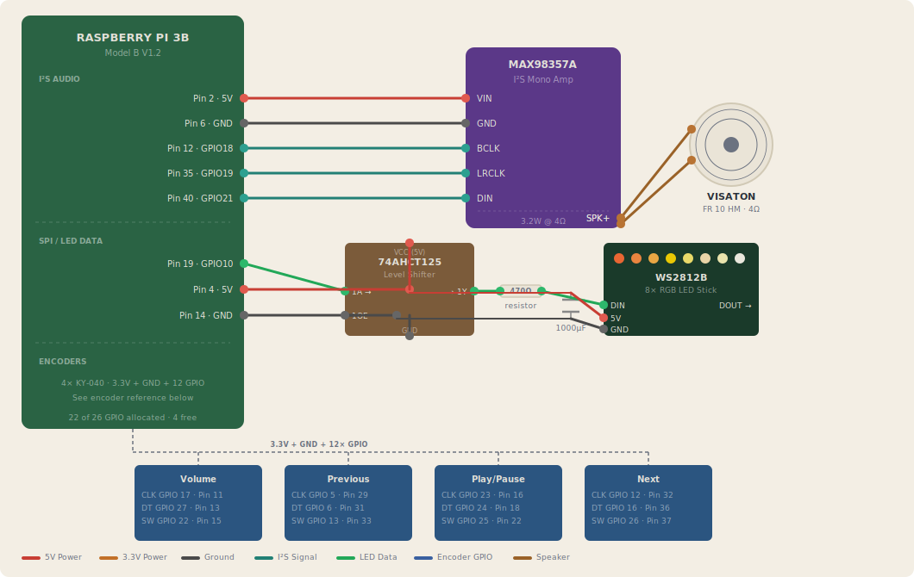
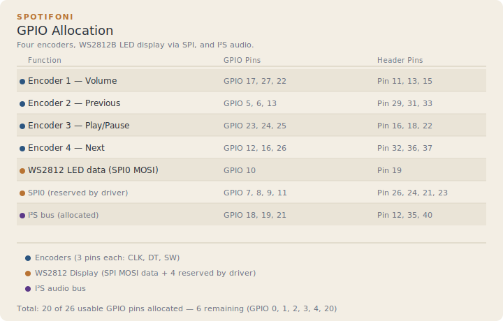

# Spotifoni Wiring

## GPIO Allocation

| Function | GPIO Pins | Header Pins |
|---|---|---|
| Encoder 1 — Volume | GPIO 17, 27, 22 | 11, 13, 15 |
| Encoder 2 — Previous | GPIO 5, 6, 13 | 29, 31, 33 |
| Encoder 3 — Play/Pause | GPIO 23, 24, 25 | 16, 18, 22 |
| Encoder 4 — Next | GPIO 12, 16, 26 | 32, 36, 37 |
| WS2812 LED data (SPI0 MOSI) | GPIO 10 | 19 |
| SPI0 (reserved by driver) | GPIO 7, 8, 9, 11 | 26, 24, 21, 23 |
| *I²S bus (allocated)* | GPIO 18, 19, 21 | 12, 35, 40 |

## I2S Amplifier

| Pi Header | Function | MAX98357A |
|---|---|---|
| Pin 2 | 5V Power | VIN |
| Pin 6 | Ground | GND |
| Pin 12 | GPIO 18 · PCM_CLK | BCLK |
| Pin 35 | GPIO 19 · PCM_FS | LRCLK |
| Pin 40 | GPIO 21 · PCM_DOUT | DIN |

The amp's GAIN pin can be left unconnected (9dB default), or tied to GND for 12dB or 3.3V for 15dB.

## WS2812B LED Display

The LED data signal passes through a 74AHCT125 level shifter to convert 3.3V GPIO to the 5V logic the WS2812B expects.

| From | To | Notes |
|---|---|---|
| Pi GPIO 10 (Pin 19) | 74AHCT125 pin 2 (1A) | 3.3V data from SPI MOSI |
| 74AHCT125 pin 3 (1Y) | 470Ω resistor → WS2812 DIN | 5V level-shifted data out |
| Pi 5V (Pin 4) | 74AHCT125 pin 14 (VCC) | Level shifter 5V supply |
| Pi GND (Pin 14) | 74AHCT125 pin 7 (GND) | Ground |
| Pi GND (Pin 14) | 74AHCT125 pin 1 (1OE) | Active-low enable — tie to GND |
| 5V rail | 1000µF cap (+) → WS2812 VCC | Separate power wire, not through Pi |
| GND rail | 1000µF cap (−) → WS2812 GND | |

## Encoder Wiring

All four encoders use the same wiring pattern. Connect each encoder's `+` pin to **3.3V** and `GND` to ground. The CLK, DT, and SW pins connect to the GPIO pins listed in the allocation table above.

| KY-040 Pin | Connects To | Notes |
|---|---|---|
| + | Pi 3.3V (Pin 1) | **Not 5V** — Pi GPIOs are 3.3V only |
| GND | Pi GND (Pin 9) | Shared ground rail |
| CLK (A) | GPIO per table | Quadrature channel A |
| DT (B) | GPIO per table | Quadrature channel B |
| SW | GPIO per table | Push button (use internal pull-up) |

## Setup Notes

1. Enable I2S output: add `dtoverlay=hifiberry-dac` to `/boot/firmware/config.txt` and reboot.
2. Enable SPI: add `dtparam=spi=on` to `/boot/firmware/config.txt` and reboot.
3. Test audio: `speaker-test -D hw:0 -t sine`.
4. Power the Pi via its micro-USB port with a ≥2.5A supply. The MAX98357A draws 5V from the Pi's GPIO header (Pin 2).
5. Connect encoders to **3.3V (Pin 1), not 5V**. Pi GPIO pins are 3.3V-tolerant only — 5V will damage them.
6. The KY-040 has onboard 10kΩ pull-ups on CLK and DT. No external resistors needed. The SW pin uses the Pi's internal pull-up (configured in software).
7. The SPI driver claims GPIO 7, 8, 9, 10, 11 — only GPIO 10 (MOSI) is physically wired.
8. The 74AHCT125 must be powered at 5V to output 5V logic. It accepts 3.3V input as logic high. Do not substitute a 74HC125 (it requires a higher input threshold).
9. The 470Ω resistor goes between the level shifter output and the first LED's DIN pin to prevent signal reflections.
10. The 1000µF capacitor goes across the LED strip's 5V and GND pins, as close to the strip as possible.
11. For 8 LEDs, power can be drawn from the Pi's 5V header via a separate wire. For larger chains (>16 LEDs), use a dedicated 5V supply with common ground.
12. Chain additional LED sticks by connecting DOUT of one stick to DIN of the next. Update `LED_COUNT` in software to match.
