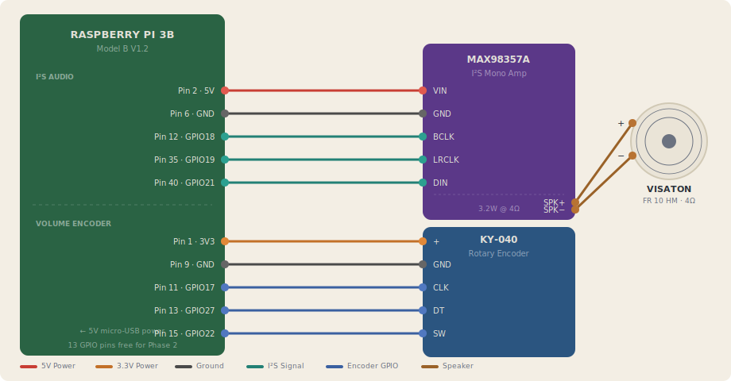
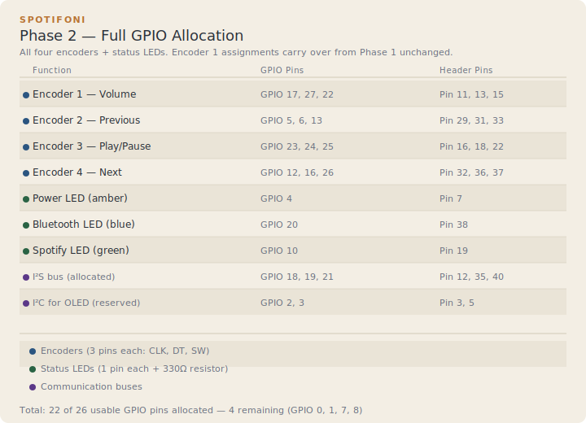

# Spotifoni Wiring

## Phase 1 — Proof of Concept

Single encoder for volume control, I2S amplifier, and speaker.

### I2S Amplifier Connections

| Pi Header | Function | MAX98357A |
|---|---|---|
| Pin 2 | 5V Power | VIN |
| Pin 6 | Ground | GND |
| Pin 12 | GPIO 18 · PCM_CLK | BCLK |
| Pin 35 | GPIO 19 · PCM_FS | LRCLK |
| Pin 40 | GPIO 21 · PCM_DOUT | DIN |

### Volume Encoder Connections

| Pi Header | Function | KY-040 |
|---|---|---|
| Pin 1 | 3.3V Power | + |
| Pin 9 | Ground | GND |
| Pin 11 | GPIO 17 | CLK (A) |
| Pin 13 | GPIO 27 | DT (B) |
| Pin 15 | GPIO 22 | SW |

### Bench Setup Notes

1. Power the Pi via its micro-USB port with a ≥2.5A supply.
2. The MAX98357A draws 5V from the Pi's GPIO header (Pin 2). At 3.2W peak this is within the Pi's 5V rail capacity.
3. Connect the KY-040 to **3.3V (Pin 1), not 5V**. Pi GPIO pins are 3.3V-tolerant only — 5V will damage them.
4. The KY-040 has onboard 10kΩ pull-ups on CLK and DT. No external resistors needed.
5. The SW pin has no pull-up on the module. Enable the Pi's internal pull-up in software: `pull_up=True` in gpiozero.
6. Enable I2S output by adding `dtoverlay=hifiberry-dac` to `/boot/firmware/config.txt` and rebooting.
7. Test audio before wiring the encoder: `speaker-test -D hw:0 -t sine`.
8. The amp's GAIN pin can be left unconnected (9dB default), or tied to GND for 12dB or 3.3V for 15dB.

---

## Phase 2 — Full GPIO Allocation

All four encoders + status LEDs. Encoder 1 assignments carry over from Phase 1 unchanged.

| Function | GPIO Pins | Header Pins |
|---|---|---|
| Encoder 1 — Volume | GPIO 17, 27, 22 | 11, 13, 15 |
| Encoder 2 — Previous | GPIO 5, 6, 13 | 29, 31, 33 |
| Encoder 3 — Play/Pause | GPIO 23, 24, 25 | 16, 18, 22 |
| Encoder 4 — Next | GPIO 12, 16, 26 | 32, 36, 37 |
| Power LED (amber) | GPIO 4 | 7 |
| Bluetooth LED (blue) | GPIO 20 | 38 |
| Spotify LED (green) | GPIO 10 | 19 |
| *I2S bus (allocated)* | GPIO 18, 19, 21 | 12, 35, 40 |
| *I2C for OLED (reserved)* | GPIO 2, 3 | 3, 5 |
